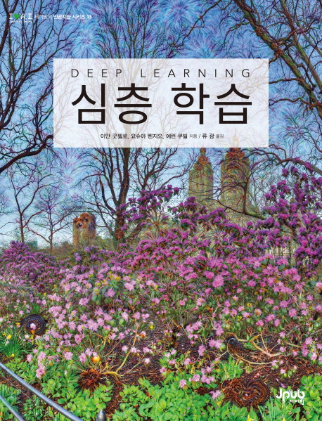

---
mainfont: "Noto Serif CJK KR"
monofont: "Cascadia Code"
sansfont: "NanumSquareRoundB"
fontsize: "10pt"
title: "Plan for ML2021"
author: [Tae Geun Kim]
date: 2021-09-19
subject: "Markdown"
keywords: [Markdown, Example]
subtitle: "To become a ML expert"
titlepage: true
toc-own-page: true
header-includes:
    - \usepackage{setspace}
    - \doublespacing
    - \usepackage[b]{esvect}
    - \usepackage{multicol}
    - \newcommand{\hideFromPandoc}[1]{#1}
    - \hideFromPandoc{
        \let\Begin\begin
        \let\End\end
      }
    - \setlength{\columnseprule}{1pt}
    - \linespread{1.5}
...

\newpage\null\thispagestyle{empty}\newpage

\tableofcontents

\newpage

# What we need to know

## 1. Overview

1. **Classical Deep Learning Algorithms**

    - [x] Convolutional Neural Network

    - [ ] Recurrent Neural Network

    - [ ] Long Short-Term Memory & Gated Recurrent Unit

    - [ ] Auto-Encoder

    - [ ] Generative Adversarial Network

2. **ML Frameworks & Tools**

    - [x] PyTorch

    - [ ] JAX

    - [ ] FastAI

    - [ ] (Optional) TensorFlow 2.0 or Flux

3. **Additional Skills & Knowledge**

    - [ ] Optimization

    - [ ] Regularization

    - [ ] Fine-tuning

    - [ ] Hyperparameter Tuning

    - [ ] Metrics & Augmentation

    - [ ] Mining Datasets

    - [ ] Initialization

4. **Modern Deep Learning Algorithms**

    - [ ] Transformer

    - [ ] MLP Mixer

    - [ ] Contrastive Learning

\newpage

## 2. Recommended Resources

1. **파이토치 첫걸음** (최건호 지음, 한빛미디어)

    * Link: [\textcolor{blue}{한빛미디어}](https://www.hanbit.co.kr/store/books/look.php?p_code=B7818450418)

    { width=30% }

    * **주요내용**
        * 아나콘다+CUDA+cuDNN 설치(그냥 코랩 쓰면 마음이 편합니다)
        * 선형회귀분석을 살펴보며 손실 함수, 경사하강법 이해하기
        * 연쇄법칙, 전파, 역전파 등 인공 신경망의 기초
        * 친절한 그림으로 CNN을 익히고, VGGNet, GoogLeNet, ResNet 살펴보기
        * RNN의 원리부터 LSTM, GRU, 임베딩, word2vec까지
        * 오버피팅과 언더피팅 해결, 드롭아웃, 정형화, 초기화, 정규화 등 학습 성능 향상법
        * 스타일 트랜스퍼, 전이학습, L-BFGS
        * 오토인코더와 시맨틱 세그멘테이션
        * GAN과 친구들(DCGAN, SRGAN, Pix2Pix, CycleGAN, DiscoGAN)

\newpage

2. **fastai와 파이토치가 만나 꽃피운 딥러닝** (제러미 하워드, 실뱅 거거 지음, 한빛미디어)

    * Link: [\textcolor{blue}{한빛미디어}](https://www.hanbit.co.kr/store/books/look.php?p_code=B7970422863)

    { width=30% }

    * **주요내용**
        * 모델에서 제품까지
        * 데이터 윤리
        * 숫자 분류기의 학습 내부 들여다보기
        * 이미지 분류
        * 그 밖의 영상 처리 문제
        * 최신 모델의 학습
        * 협업 필터링 깊게 알아보기
        * 테이블 데이터 모델링 깊게 알아보기
        * NLP 깊게 알아보기: 순환 신경망
        * fastai의 중간 수준 API로 데이터 변환하기
        * 밑바닥부터 구현하는 언어 모델
        * 합성곱 신경망
        * ResNets
        * 애플리케이션 구조 깊게 살펴보기
        * 학습 과정
        * 기초부터 만드는 신경망
        * CAM을 이용한 CNN의 해석
        * 밑바닥부터 만드는 Learner 클래스

\newpage

3. **심층학습** (이안 굿펠로, 요슈아 벤지오, 에런 쿠빌 지음, 제이펍)

    * Link: [\textcolor{blue}{교보문고}](http://www.kyobobook.co.kr/product/detailViewKor.laf?ejkGb=KOR&mallGb=KOR&barcode=9791188621422&orderClick=LAG&Kc=)

    { width=30% }

    * **주요내용**
        * 선형대수 31
        * 확률론과 정보 이론 57
        * 수치 계산 87
        * 기계 학습의 기초 107
        * 심층 순방향 신경망 185
        * 심층 학습을 위한 정칙화 251
        * 심층 모형의 훈련을 위한 최적화 기법 303
        * 합성곱 신경망 367
        * 순차열 모형화를 위한 순환 신경망과 재귀 신경망 411
        * 실천 방법론 463
        * 선형 인자 모형 542
        * 자동부호기 557
        * 표현 학습 583
        * 심층 학습을 위한 구조적 확률 모형 617
        * 몬테카를로 방법 653
        * 분배함수 공략 671
        * 근사 추론 701
        * 심층 생성 모형 727

\newpage

4. **만들면서 배우는 파이토치 딥러닝** (오가와 유타로 지음, 한빛미디어)

    * Link: [\textcolor{blue}{한빛미디어}](https://www.hanbit.co.kr/store/books/look.php?p_code=B7628794939)

    { width=30% }

    * **주요내용**
        * 1장. 화상 분류와 전이학습(VGG)
        * 2장. 물체 인식(SSD)
        * 3장. 시맨틱 분할(PSPNet)
        * 4장. 자세 추정(OpenPose)
        * 5장. GAN을 활용한 화상 생성(DCGAN, Self-Attention GAN)
        * 6장. GAN을 활용한 이상 감지(AnoGAN, Efficient GAN)
        * 7장. 자연어 처리를 활용한 감정 분석(Transformer)
        * 8장. 자연어 처리를 활용한 감정 분석(BERT)
        * 9장. 동영상 분류(3DCNN, ECO)

\newpage

# Blueprint

## 1. Way of Study

* 스터디 모임은 1주에 1회를 원칙으로 한다.

* 스터디 단위는 기본 2주로 하여 한 주는 특정 토픽에 대해 이론 및 구현을 하고, 나머지 한 주는 추가 이론이나 기술 튜토리얼을 진행한다. 
    * 이론 및 구현은 2명이 각각 이론파트와 구현파트를 나눠 맡는다.
    * 이론 파트를 맡은 사람은 논문 리뷰를 진행한다. 이때 리뷰할 논문은 이전 스터디에서 토의하여 정한다. 
    * 구현 파트를 맡은 사람은 책이나 논문 혹은 블로그를 참고하여 예제 코드를 구현하여 발표한다.
    * 추가 이론이나 기술 튜토리얼은 나머지 한 명이 맡아 진행하며 진행할 내용은 이전 스터디에서 앞의 Overview의 *ML Framework & Tools*, *Additional Skills & Knowledge* 혹은 *만들면서 배우는 파이토치 딥러닝* 를 참고하여 정한다.

* 위에서 설명한 2주 단위의 한 스터디가 끝나면, 파트를 바꿔 다시 다음 스터디를 진행한다. 이때, 파트는 이전 스터디에서 토의를 통하여 정하되, 부담을 느끼는 스터디원이 있으면 파트를 바꾸지 않아도 좋다.